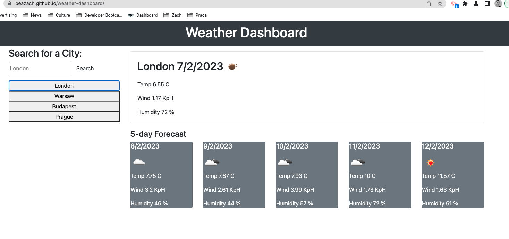
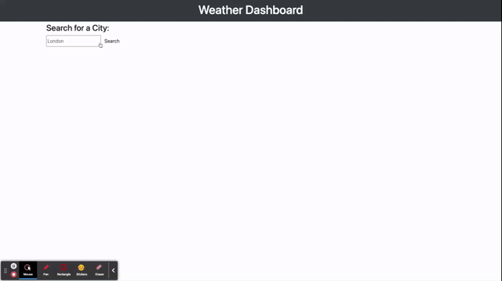

# weather-dashboard
Deployed link: https://beazach.github.io/weather-dashboard/

## Description 
In this project I was tasked with creating an app that allows users to see the weather forecast for cities of their choosing.

### Acceptance Criteria
Create a weather dashboard with form inputs.

When a user searches for a city they are presented with current and future conditions for that city and that city is added to the search history.

When a user views the current weather conditions for that city they are presented with:

- The city name

- The date

- An icon representation of weather conditions

- The temperature

- The humidity

- The wind speed

When a user views future weather conditions for that city they are presented with a 5-day forecast that displays:

- The date

- An icon representation of weather conditions

- The temperature

- The humidity

When a user clicks on a city in the search history they are again presented with current and future conditions for that city.

* I have added wind data to the forecast to keep the weather data consistent. 

## Usage
Application appearance:

Screen
The following animation demonstrates the application funcitonality:

Link:
https://drive.google.com/file/d/1XiXKRQzEkkFoK0H10xZKgpsxX48Helhe/preview

## Contact Details
Please leave a note or get in touch about suggestions for code improvements, future projects and collaborations.

## License 
MIT

## Resources 
- https://courses.bootcampspot.com/courses/3029/ (accessed 7 February 2023)
- https://fantastic-pudding.vercel.app/ (accessed 7 February 2023)

